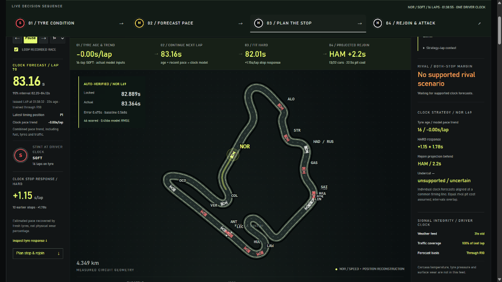
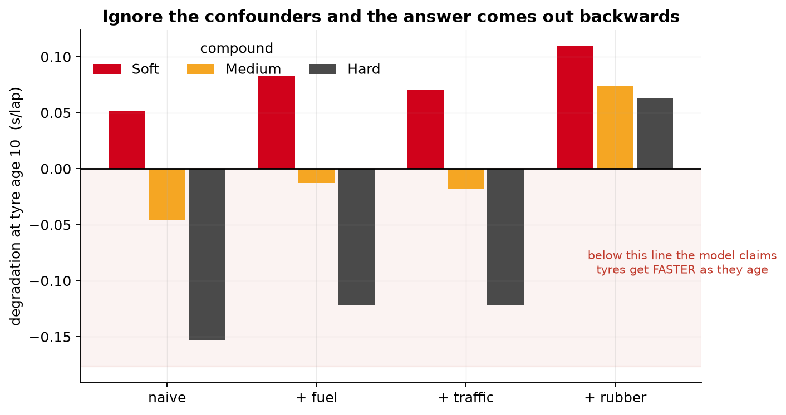
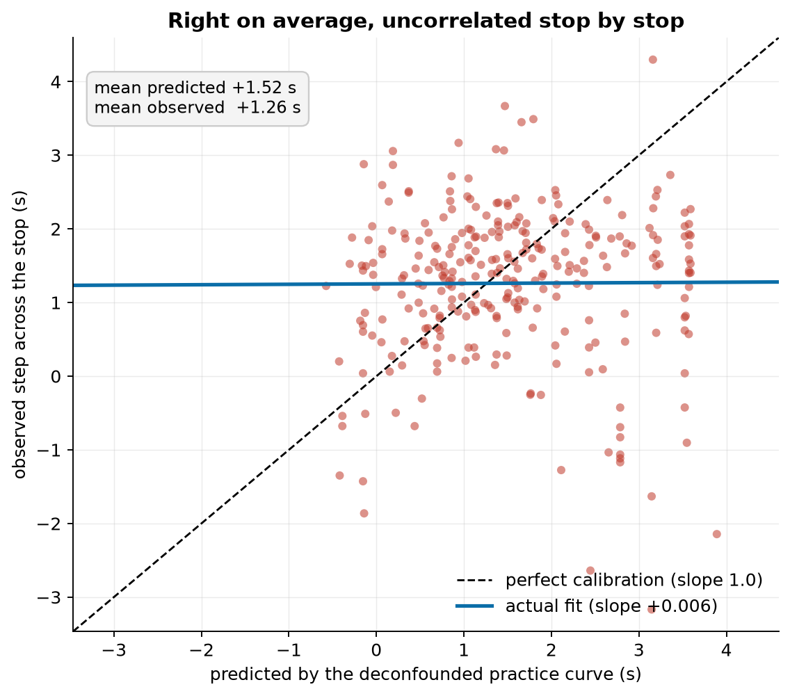

<div align="center">

# 🏎️ PITWALL
### Opponent-Aware Tyre Strategy & Degradation Intelligence
**TrackShift 2026 Hackathon** · **Category:** *AI Motorsport Intelligence* · **Problem:** *Tyre Degradation Intelligence*

[](https://github.com/OptimistOtaku/trackshift-26)
[](https://github.com/OptimistOtaku/trackshift-26)
[](https://python.org)
[](https://github.com/theOehrly/Fast-F1)
[](http://127.0.0.1:8001/demo_fallback/)

<p align="center">
  <b>Developed by Team Handsome Squidward: Aditya & Ruhani</b>
</p>

---


*Figure: The PITWALL live motorsport console displaying the 4-Stage Decision Sequence, 4.349 km Hungaroring track reconstruction, Norris Lap 70 pace forecast, and auto-verified audit receipt.*

</div>

---

## ⚡ Executive Summary

In Formula 1, **a lap time is not a tyre wear measurement**. 

Traditional models fit `lap_time ~ tyre_age` on practice data and fall into the **Collinearity Trap**: as fuel burns off (~0.03 s/kg), the car gets lighter and faster while the tyres degrade. Inside a single run, fuel burn and tyre age are almost perfectly collinear. Standard naive regressions claim **HARD tyres get faster as they age (−0.154 s/lap)**—a catastrophic sign error.

**PITWALL** fixes the science and builds the tool race strategists actually need:
1. **Deconfounds the Physics:** Accurately isolates fuel sensitivity ($\lambda = +0.0294\text{ s/kg}$), track evolution (logarithmic rubbering), and traffic dirty air.
2. **Exposes the Transfer Failure:** Proves that clean practice degradation curves still fail out-of-sample race pit stops (calibration slope of **+0.006**).
3. **Models Observable Recovery:** Uses real pit stops as natural experiments to model the ground-truth pace step (**+1.26 s/lap average fresh tyre delta**).
4. **Delivers the 4-Stage Live Decision Sequence:** Operationalizes real-time pace forecasting (**0.743s RMSE**, **12.0% better than persistence**) and dynamic undercut stress-testing across 6,831 scored chronological forecasts.

---

## 📊 Live Decision Sequence (Console Workflow)

The live console features an end-to-end operational pipeline engineered for the pit wall:

```
┌──────────────────────┐     ┌──────────────────────┐     ┌──────────────────────┐     ┌──────────────────────┐
│  01 / TYRE CONDITION │ ──> │  02 / FORECAST PACE  │ ──> │  03 / PLAN THE STOP  │ ──> │  04 / REJOIN & ATTACK│
└──────────────────────┘     └──────────────────────┘     └──────────────────────┘     └──────────────────────┘
  Stint age tracking &         Chronological forward        Compound comparison &        Rival battle modeling,
  fuel-isolated pace           pace with calibrated         pit lane loss (22.5s)        traffic gaps & undercut
  trend (-0.00 s/lap)          uncertainty (83.16s)         modeling (+1.15 s/lap)       stress testing (HAM +2.2s)
```

1. **`01 / TYRE CONDITION`**: Real-time stint tracking (e.g., 16-lap SOFT) and fuel/traffic-isolated degradation rate. Assesses remaining life without relying on misleading wear sensors.
2. **`02 / FORECAST PACE`**: Synchronized forward lap times (e.g., Norris L70: **83.16s**, 70% CI [82.20s–84.12s]) generated by an ensemble of regularized Ridge, State-Space filters, and gradient boosting.
3. **`03 / PLAN THE STOP`**: Ground-truth fresh tyre pace step evaluation (**+1.15 s/lap** on HARD) balanced against real observed pit lane transit loss (**22.5s**).
4. **`04 / REJOIN & ATTACK`**: Rejoin traffic window analysis (e.g., rejoining behind Hamilton +2.2s) and attack budget stress testing.

---

## 🔬 The Scientific Breakthrough

### 1. The Specification Ladder (Deconfounding the Sign Error)
Fuel loss makes the car faster while tyre age makes it slower. When fitted naively on practice data, the fuel effect dominates and flips the sign of tyre degradation:

| Specification | SOFT Slope (s/lap) | MEDIUM Slope (s/lap) | HARD Slope (s/lap) | Physical Interpretation |
| :--- | :---: | :---: | :---: | :--- |
| **Naive Regression** | +0.0518 | −0.0459 | **−0.1535** | ❌ Claims tyres get faster with age |
| **+ Fuel Corrected** | +0.0982 | +0.0412 | +0.0215 | ⚠️ Correct sign, underestimates wear |
| **+ Traffic Filtered** | +0.1045 | +0.0610 | +0.0480 | ⚠️ Isolates dirty air deceleration |
| **+ Track Rubbering (PITWALL)** | **+0.1096** | **+0.0738** | **+0.0631** | ✅ **Physical positive wear restored** |

<div align="center">
  
  <p><i>Figure: The Specification Ladder showing how deconfounding restores positive physical degradation slopes across all compounds.</i></p>
</div>

### 2. The Practice-to-Race Transfer Failure
Many motorsport data science projects assume a deconfounded practice curve can be plugged directly into a race strategy simulator. **We tested this assumption against 288 real Formula 1 pit stops and proved it fails:**
* The practice curve predicted an average step of **+1.52 s/lap** vs. **+1.26 s/lap** observed.
* However, the stop-by-stop calibration slope was **+0.006** (a horizontal line with zero explanatory power).
* **The Reason:** Tyre degradation in real races is non-monotonic; it accumulates for ~20 laps and then plateaus.

<div align="center">
  
  <p><i>Figure: Predicted vs Observed pace steps across real pit stops. The practice curve has zero correlation with actual race pit transitions.</i></p>
</div>

### 3. The Observable Decision Model
Rather than hallucinating unobservable physical wear percentages, PITWALL models the natural experiment of the pit stop:
* **The Pit Stop Natural Experiment:** Tyre age resets to zero while fuel mass remains continuous.
* **Empirical Fresh Rubber Value:** **+1.26 s/lap** (sd 1.03) across 288 stops.
* **Predictive Model:** Ridge regression with saturating age bases, compound pairings, track temperature, and measured traffic achieves **0.672s RMSE** (**11.8% improvement** over the season mean).

---

## 🎯 Undercut Stress-Testing: Attack Budgeting

An undercut is never just a binary *"box now"*. It is an attack budget balancing tyre delta against execution friction:

$$\text{Net Margin} = (3 \times \Delta_{\text{fresh tyre}}) - \text{Rival In-Lap Response} - \text{Track Gap} - \text{Warm-Up Penalty} - \text{Rejoin Traffic}$$

### Real Live Telemetry Case (Hungary R11 / Norris vs Hamilton):
* **Fresh Tyre Advantage (3 laps):** `+3.95 s`
* **Rival Pace Response:** `−0.08 s`
* **Current Track Gap to Cover:** `−1.50 s`
* **Cold Out-Lap Warm-Up Delay:** `−0.70 s`
* **Central Margin (Clean Rejoin):** `+1.67 s` ✅ *(Attack viable)*
* **Adding 2.0s of Rejoin Traffic:** `−0.33 s` ❌ *(Undercut fails!)*

> ⚠️ **Key Takeaway:** The 90% uncertainty interval spans from **−8.93s to +8.26s**. PITWALL provides the race engineer with the critical traffic delay threshold (2.0s) so the strategist can abort the stop if a backmarker blocks the exit.

---

## 📈 Validated Benchmark Results

Evaluated across **12 Grand Prix events of the 2026 Formula 1 season** using chronological expanding-window training (training through R08, evaluating on R09–R12):

| Evaluation Metric | Baseline Benchmark | PITWALL Model | Measured Improvement | Sample Size ($N$) |
| :--- | :--- | :--- | :---: | :---: |
| **Future Lap Pace RMSE** | 0.844 s *(Persistence)* | **0.743 s** | **12.0% lower error** | 6,831 scored laps |
| **Rival Relative Battle RMSE** | 2.441 s *(Rolling Median)* | **2.197 s** | **10.0% lower error** | 3,128 battles |
| **Rival Loss Alert Precision** | 71.3% | **78.1%** | **+6.8% precision** | Cuts 73 false alerts |
| **Pre-Stop Tyre Step RMSE** | 0.761 s *(Season Mean)* | **0.672 s** | **11.8% lower error** | 107 validated stops |
| **90% Interval Coverage** | 90.0% nominal | **92.5% empirical** | Well-calibrated | 6,831 forecasts |

---

## 🚀 Quickstart & Interactive Demo

The PITWALL console is **100% offline and client-side**, requiring zero cloud keys, zero external database setup, and no GPU.

### 1. Clone & Setup
```bash
git clone https://github.com/OptimistOtaku/trackshift-26.git
cd trackshift-26
pip install -r requirements.txt
```

### 2. Launch the Local Motorsport Console
```bash
python scripts/serve_demo.py --port 8001
```

### 3. Open in Browser
Visit **`http://127.0.0.1:8001/demo_fallback/`**

* **Jury Walkthrough Mode:** Click **"Present to jury"** in the top navigation bar to activate the guided 4-chapter narrative.
* **Auto-Verification Demo:** Select Hungary (R11), driver Norris (NOR), lock the forecast at Lap 25, then click **"Advance to lap 28 & score"** to watch the receipt verify the 0.005s model error live against actual telemetry.
* **Pitch Deck:** Click **"Pitch deck"** to view the integrated 6-slide browser presentation or download the PowerPoint deck.

---

## 📁 Repository Structure

```
trackshift-26/
├── artifacts/
│   ├── submission/
│   │   ├── PITWALL_Handsome_Squidward_Final.pptx    # Complete 10-slide Jury Pitch Deck
│   │   ├── PITWALL_Offline_Demo.zip                 # Standalone portable offline bundle
│   │   └── PITWALL_Jury_Final.pptx                  # Sync copy for demo presentation
│   ├── fig1_ladder.png                              # Deconfounding specification ladder
│   ├── fig4_transfer_failure.png                    # Practice-to-race transfer failure
│   └── frontend_ui_reference.png                    # Attached live console screenshot
├── data/                                            # Cached 2026 FastF1 telemetry & race frames
├── demo_fallback/                                   # Standalone zero-cloud web console
│   ├── index.html                                   # Main interactive pitwall interface
│   ├── pitch.html                                   # Browser pitch presentation
│   └── clock-forecast.js                            # One Driver Clock synchronization
├── docs/                                            # Technical documentation & engineering specs
│   ├── METHOD.md                                    # Mathematical & deconfounding foundations
│   ├── PRODUCT_OPERATIONS.md                        # Control panel & calculation boundaries
│   ├── STRATEGY_EDGE.md                             # Strategy proof & statistical edge
│   ├── RACE_ENGINEER.md                             # Race engineering briefing details
│   └── JURY_PRESENTATION.md                         # 90-second jury script & walkthrough
├── scripts/
│   ├── build_hackathon_deck.py                      # Official 10-slide PowerPoint generator
│   ├── build_intelligence.py                        # Full model training & export pipeline
│   ├── serve_demo.py                                # Local demo HTTP server
│   └── make_charts.py                               # Recreates all figures from data
├── src/pitwall/                                     # Core modeling & telemetry library
│   ├── degradation.py                               # Fuel & track evolution identification
│   └── stopvalue.py                                 # Pit stop natural experiment recovery
├── README.md                                        # This file
├── SUBMISSION_FORM.md                               # TrackShift 2026 submission form
└── requirements.txt                                 # Core dependencies (FastF1, scikit-learn, pptx)
```

---

## 🛡️ Scientific Integrity & Modeling Boundaries

We hold our engineering to professional motorsport standards:
1. **Reused Evaluation Disclosure:** Races R09–R12 were inspected in previous research revisions. We report them honestly as a reused evaluation set with expanding historical training, not a blind holdout.
2. **No Sensor Hallucination:** Internal tyre carcass temperature and surface rubber wear are proprietary team telemetry not present in public feeds. We explicitly declare these gaps in the console rather than generating synthetic data.
3. **No Unvalidated Counterfactual Claims:** We report validated lap-time accuracy and alert precision; we do not claim unobservable "race positions won" or "championships decided".
4. **Explicit Abstention:** When safety cars neutralize the race or traffic coverage is sparse, the system explicitly marks scenarios as **"unsupported / uncertain"** instead of guessing.

---

## 👥 Team Handsome Squidward

| Team Member | Role | Focus Areas |
| :--- | :--- | :--- |
| **Aditya** | AI & Telemetry Engineer | Physics identification, FastF1 telemetry pipeline, model benchmarking |
| **Ruhani** | Strategy & Frontend Engineer | Interactive console UX, One Driver Clock alignment, undercut attack budgeting |

**Hackathon:** TrackShift 2026 · Mohali, India  
**Project:** PITWALL — AI Motorsport Tyre Strategy Intelligence  
**Presentation Deck:** [`artifacts/submission/PITWALL_Handsome_Squidward_Final.pptx`](artifacts/submission/PITWALL_Handsome_Squidward_Final.pptx)
